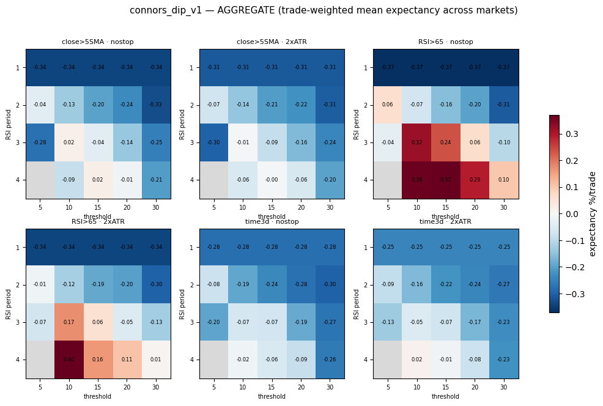
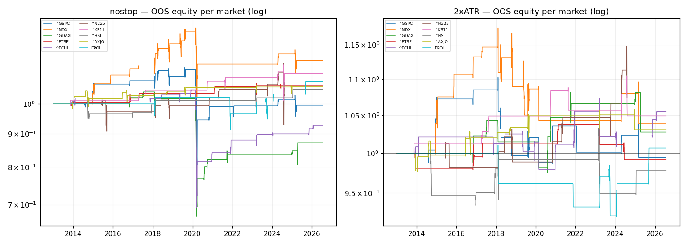

# Does Buying the Dip Work on Stock Indices?

**Testing the Connors mean-reversion strategy across ten global indices, with costs charged**

*Trading Rules Research · Experiment 01 · July 2026*

---

## How this was built

*Pulled from the running system this session, not written from memory.*

| | |
|---|---|
| **Hardware** | MacBook Pro, Apple M3 Pro (11 cores: 5P+6E), 36GB RAM — `system_profiler SPHardwareDataType` |
| **OS** | macOS 26.5.2, build 25F84 — `sw_vers` |
| **Python** | 3.9.6, project venv |

**Libraries actually imported** by this experiment's own scripts (`grep`, then `pip freeze` for versions):

| Library | Ver. | Role |
|---|---|---|
| pandas | 2.3.3 | price series, trade tables, grid results |
| numpy | 2.0.2 | equity-curve / metric arrays |
| matplotlib | 3.9.4 | heatmap + equity-curve figures |
| PyYAML | 6.0.3 | `config.yaml` (costs, wall) + experiment spec |
| yfinance | 1.2.0 | daily OHLCV for the ten index tickers |
| requests | 2.32.5 | HTTP layer under the fetch helpers |
| pyarrow | 21.0.0 | parquet read/write, local price cache |

**Real data, simulated trading**: prices are real historical data, not simulated. What's
simulated is the trading — what these rules would have done. Synthetic price series appear
only in unit tests, never in a published result.

---

## What this paper tests — and what it doesn't

This paper tests **stock market indices**: the S&P 500, the Nasdaq 100, the DAX, and seven
others. It asks whether buying a sharp short-term drop in an index that is in a long-term
uptrend makes money after trading costs.

It does **not** test individual stocks. That is a genuinely different question with a
different answer, and it gets its own paper (Experiment 02). The distinction matters more
than it might appear: the strategy family examined here was originally researched on both
instrument types, and separating them turns out to be the single most important thing you can
do when evaluating it. An effect can be real in one and useless in the other.

**Short version of the result:** the textbook version of the strategy loses money after costs
on every index we tested. But a milder variation of the same idea survived a strict
out-of-sample test — and then failed for an entirely different reason: it fires so rarely
that you couldn't build anything on it.

---

## 1. The idea being tested

The strategy is simple enough to describe in four lines:

1. Only consider buying when the index is above its 200-day moving average — that is, when
   the long-term trend is up.
2. Wait for a very short-term measure of "oversold" to hit an extreme. The usual tool is RSI
   with a 2-day lookback, dropping below 10.
3. Buy at that day's closing price.
4. Sell when the index closes above its 5-day moving average — usually two to five days later.

The reasoning behind it is genuinely sensible. Over a horizon of a few days, a lot of selling
is not driven by news. It's driven by mechanics and emotion: margin calls, stop-loss orders
triggering in sequence, funds forced to raise cash, and ordinary people panicking. That kind
of selling pushes prices below where they'd otherwise sit — and once the forced sellers are
finished, prices tend to snap back. Buying the panic, in a market that's otherwise healthy,
is a bet on that snap.

Note the deliberate design: it only buys weakness inside strength. The 200-day filter is what
separates "buying a dip" from "catching a falling knife." Without it, the strategy would
happily buy every step of a bear market.

---

## 2. Why challenge it? (Connors deserves a fair hearing)

The most cited version of this idea comes from **Larry Connors and Cesar Alvarez**, whose 2008
book *Short Term Trading Strategies That Work* was built on a study of **more than eight
million trades between 1995 and 2007**. That is not a casual claim — it's one of the larger
datasets any retail-facing strategy has been built on, and the finding was consistent: after
a very short-term RSI reading dropped to an extreme, the following few days produced
above-average returns, and the lower the reading, the stronger the effect.

They also found something that cuts against conventional practice, and were right to publish
it: the standard 14-period RSI that most traders use shows **no** statistical edge at these
horizons. Only very short lookbacks carry information. That's a genuinely useful result.

So why test it at all, if the research is solid?

**Because "the effect existed" and "the strategy makes money" are different claims**, and four
specific gaps sit between them:

**First — costs.** Published backtests in this family are typically quoted *gross*: before
spread, slippage, and commission. That's fine for demonstrating that a market behaviour
exists. It's fatal for judging a strategy that takes many small, quick profits, because every
one of those small profits pays a toll. A strategy averaging 0.3% per trade and paying 0.2% in
costs has given away two thirds of itself before you've argued about anything else. This is
the single biggest gap, and it's the one we close first.

**Second — publication.** The work came out in 2008. Anything genuinely profitable and simple
enough to describe in four lines attracts capital, and capital competes the edge away. Testing
on data from 2013 onwards measures what *survived* being published, which is the only number
that matters to anyone reading about it today.

**Third — instrument type.** The eight-million-trade study was largely on individual stocks.
The four-line index version above is the widely circulated retail formulation. Those are not
the same strategy, and there's no guarantee that a behaviour observed across thousands of
individual companies shows up in a broad index that averages them all together. Separating
the two — indices here, stocks in Experiment 02 — is precisely the point of splitting these
papers.

**Fourth — geography.** Most of the published work is American. If the underlying cause is
human behaviour under stress, the effect should appear in Frankfurt, Tokyo and Sydney too.
If it only appears in the US, it's more likely a quirk of one market's structure than a
universal behaviour.

Note what we are *not* claiming. We're not saying the research was wrong, or that mean
reversion isn't real. We're asking a narrower and more useful question: **under realistic
conditions, today, does this specific implementation clear its own costs?**

---

## 3. How the test was built

### The data

Daily price history for ten indices, from Yahoo Finance, using the maximum available history:

| Index | Market | History from |
|---|---|---|
| S&P 500 | United States | 1927 |
| Nikkei 225 | Japan | 1965 |
| FTSE 100 | United Kingdom | 1984 |
| Nasdaq 100 | United States | 1985 |
| Hang Seng | Hong Kong | 1986 |
| DAX | Germany | 1987 |
| CAC 40 | France | 1990 |
| ASX 200 | Australia | 1992 |
| KOSPI | South Korea | 1996 |
| MSCI Poland ETF | Poland (proxy) | 2010 |

The Polish entry is a US-listed ETF standing in for the Warsaw market, because no usable
long history exists for the WIG indices on free data. It has too little history to carry any
weight, and was labelled "reference only" *before* the test ran, not afterwards.

One advantage of testing indices: they don't suffer from **survivorship bias**. When you test
a strategy on individual stocks, the companies that went bankrupt tend to be missing from the
data, which flatters your results. An index has no such problem — the S&P 500 of 1987 is
still in the record even though many of its members aren't. (This becomes the central issue
in Experiment 02, where it destroys about a third of the apparent profit.)

### The rules that varied, and the ones that didn't

Rather than test one version of the strategy, we tested 120 variations per index — every
combination of:

- **How you measure "oversold":** RSI over 1, 2, 3, or 4 days
- **How oversold is oversold enough:** RSI below 5, 10, 15, 20, or 30
- **When to sell:** on a close above the 5-day average (the textbook exit), when RSI recovers
  above 65, or simply after 3 days
- **Whether to use a stop-loss:** none, or a stop placed two average-daily-ranges below entry

Held constant throughout: long positions only, only when the index is above its 200-day
average, entering at the closing price, one position at a time.

**Costs were charged on every single trade**: 0.1% of slippage on each side plus 0.2% in
round-trip commission. Every number in this paper is after those costs.

### The rule that keeps you honest

Testing 120 variations across ten markets means 1,200 experiments. Some will look brilliant
purely by chance — that's arithmetic, not bad luck. The standard defence, borrowed from
clinical research, is to split the data in two:

- **Exploration data** (everything up to the end of 2012): search freely, look at everything.
- **Sealed data** (2013 onwards): untouched, unlooked-at, unexplored.

You explore on the first half, pick one version, **write down in advance exactly what result
would count as success**, and only then run it on the sealed half. If it works on data it has
never seen, it's probably real. If it doesn't, it memorised the past.

In this project the wall isn't a promise — the software physically refuses to run a search on
sealed data. It will only accept a single, explicitly named strategy version. You can't peek
even if you want to.

A note on vocabulary, since three terms recur below:

- **Expectancy** — the average profit or loss per trade, as a percentage. The single most
  important number.
- **Profit factor** — total gains divided by total losses. Above 1.0 is profitable; below is
  not. Around 1.3 is respectable for a short-term system.
- **Drawdown** — the worst peak-to-trough fall along the way. What you'd actually have to
  live through.

---

## 4. Result, part one: the textbook version doesn't work

Across all ten indices, using the published exit (sell on a close above the 5-day average),
and the short time-stop variant as well — **every single combination lost money after costs.**
Trade-weighted average expectancy came out between **−0.23% and −0.29% per trade** regardless
of which stop-loss setting was used.

This isn't a marginal result or a close call. The textbook strategy, applied to indices, is
underwater across the entire global panel.

**Why?** Not, primarily, because the effect vanished. Note the timing: our exploration window
runs to the end of 2012, so it *includes* Connors' own 1995–2007 study period. If arbitrage
decay were the whole story, we'd expect the strategy to work in the early data and fail
later. Instead it fails throughout.

The dominant cause is simply **costs**. This is a strategy of many small, fast wins. Gross of
costs, it looks like a modest but real edge. Net of the roughly 0.3% round trip that a retail
trader actually pays, the edge is inverted. The strategy doesn't fail because the market
behaviour is imaginary; it fails because the behaviour is smaller than the toll charged for
exploiting it.

That is a specific, testable, and — I'd argue — more interesting criticism than "the strategy
doesn't work."

---

## 5. An interruption: the bug that nearly became a finding

Something worth documenting, because it's the sort of thing that quietly ruins backtests.

The first run showed near-universal rejection — including on the S&P 500, the deepest and
cleanest dataset in the panel, where at least *some* signal should appear. It also produced
one obviously insane cell claiming a **+6,425% return on a single trade**.

A null result on a textbook case usually means a bug, not a discovery. So instead of writing
up the rejection, we went looking.

The cause: the research code had reused the live trading system's RSI function. That function
had a quirk that was perfectly correct in its original context and completely wrong in this
one — a period with no down days was being reported as an RSI of 50 (neutral) rather than
100 (maximum strength). The consequence was that the "sell when RSI recovers above 65" exit
could never trigger for the shortest lookback. The position was never sold. It was held from
1927 to 2012. That's where the 6,425% came from: an accidental 85-year buy-and-hold, wearing
the costume of a day trade.

It was fixed with a mathematically standard RSI written specifically for research use, and
every number in this paper comes from after the fix.

**The general lesson:** reusing production code inside a research context silently imports its
assumptions. Those assumptions were valid where they came from. They were invalid here. If
the absurd cell hadn't been so obviously absurd, the distortion in the neighbouring cells
would have gone unnoticed — and the "finding" would have been an artefact of somebody's
sensible-in-context default.

---

## 6. Result, part two: something else showed up

With the textbook version dead, one region of the grid was still positive — and it described
a noticeably different strategy from the one we set out to test.

It appeared with the **"hold until strength returns"** exit (sell when RSI recovers above 65,
rather than at the first bounce), at **slightly longer lookbacks** (3–4 days rather than 2)
and **moderate rather than extreme** oversold thresholds.



*Every strategy variant tested, averaged across the ten markets. Each of the six panels is one
combination of exit rule and stop-loss; within a panel, rows are the RSI lookback (1–4 days)
and columns are how deep the oversold reading has to go (RSI below 5 through 30). Each cell's
colour is its average profit or loss per trade after costs — red is a loss, yellow is roughly
break-even, green is a profit, and grey marks cells with too few trades to interpret. The thing
to notice is how overwhelmingly red the grid is: the two textbook exits (top-left and bottom-row
panels) are underwater almost everywhere. The only sustained patch of green sits in the two "sell
when RSI recovers above 65" panels, at the longer 3–4-day lookbacks and middling thresholds —
that green island is the surviving strategy discussed below.*

| Index | Average expectancy in that region |
|---|---|
| KOSPI | +0.99% *(small sample — fragile)* |
| Nasdaq 100 | +0.86% |
| CAC 40 | +0.72% |
| S&P 500 | +0.41% *(largest sample: up to 527 trades, 67% winners)* |
| ASX 200 | +0.26% |
| DAX | +0.16% |
| Hang Seng | +0.13% |
| FTSE 100 | −0.18% |
| Nikkei 225 | −0.38% |

**Seven of nine markets positive**, including the deepest-data indices, and present with or
without a stop-loss. That breadth matters: a single market showing a positive result is
noise, but the same pattern appearing across the US, France, Australia, Germany and Hong Kong
suggests something structural.

In plain English, the surviving pattern is:

> **Buy a moderate multi-day pullback — not a violent two-day crash — and hold until
> short-term strength returns, rather than selling the first bounce.**

There is an obvious economic reason this survives where the textbook version dies. Holding
longer means fewer round trips for the same amount of captured movement, so the fixed cost
per unit of profit falls. The textbook version's fast exit is precisely what makes it
cost-fragile.

It's worth being clear that this was a **discovery, not a hypothesis**. We went looking for
one thing and found another. That makes it weaker evidence than a prediction made in advance
— which is exactly why the next step exists.

---

## 7. The sealed test

Before touching any data from 2013 onwards, the following was written down and never edited:

> **What we're testing:** buying moderate multi-day pullbacks in uptrending indices and
> holding until short-term strength returns. This is an emergent finding from the search, not
> the original hypothesis, and is weighted accordingly.
>
> **The exact rule:** RSI over 4 days drops below 10, index above its 200-day average, buy at
> the close, sell when RSI recovers above 65. Round numbers taken from the middle of the
> positive region — not the single best-performing cell.
>
> **Two versions:** without a stop-loss (as discovered) and with one (as anyone would
> actually trade it).
>
> **It fails unless all three of these hold:** average expectancy positive after costs;
> profit factor of at least 1.10; and both the S&P 500 and Nasdaq 100 individually positive.
> Korea and Poland are reported but don't count toward pass or fail — too little data.

**The result: it passed all three.**

| Test | Result | |
|---|---|---|
| Positive expectancy | **+0.37% per trade** | Pass |
| Profit factor ≥ 1.10 | **1.30** | Pass |
| S&P 500 and Nasdaq both positive | +0.11% and +1.28% | Pass |

Seven of eight counting markets were profitable on data the strategy had never seen. On the
face of it, that's a validated strategy.



*The pre-registered variant running on the sealed 2013-onwards data it had never seen — one line
per market, growth of one unit on a log scale, for the no-stop version (left) and the version
with a 2×ATR stop (right). Each flat stretch is a period holding no position, and each jump is a
single completed trade; because the strategy fires so rarely, every line is a short staircase of
just a handful of steps rather than a smooth curve. The no-stop panel makes the fragility visible
— most markets drift up, but Germany (^GDAXI) and France (^FCHI) end below where they started, and
one violent step down in early 2020 shows how much a single trade can swing a market with so few
of them.*

---

## 8. Why passing isn't the same as winning

The criteria passed, and that stands. But the evidence underneath it is thin, and reporting
that honestly is not the same as moving the goalposts.

**The sample is tiny.** Roughly **81 trades in thirteen years** across eight markets — six to
thirteen per market, or about one per market per year. The S&P 500's +0.11% comes from
thirteen trades. That is a coin flip wearing a pass mark. It's not evidence of an edge; it's
an absence of evidence against one.

**Some statistics are nonsense on their face.** The FTSE shows a profit factor of 37.7 — which
sounds spectacular until you notice it comes from six trades containing one small loss.
That's not performance, it's arithmetic on a sample too small to mean anything.

**The result leans on one market.** The Nasdaq's +1.28% carries the average. The DAX and CAC
both turned negative out-of-sample after being positive in exploration. A "broad" effect
became considerably narrower once tested.

**Financing costs finish it.** Holding for about fifteen calendar days on a leveraged product
costs roughly **0.20–0.23% per trade** in overnight financing at typical rates — more than
half of the +0.37% gross edge. The version with a stop-loss, which is the only version a sane
person would trade, nets out to approximately zero.

**And it's too slow to be a strategy.** One trade per market per year isn't a process. It's an
occasional event you'd need to build an entire monitoring apparatus around, for a payoff
statistically indistinguishable from zero after financing.

**Verdict: shelved.** Not disproven. Not usable either.

---

## 9. What this experiment actually taught us

The most valuable output wasn't a strategy — it was realising that **this test could never
have succeeded**, and that this was knowable before we ran it.

With about one trade per market per year, thirteen years of sealed data was always going to
produce fewer than a hundred trades. At that sample size, a positive result can't be
distinguished from luck. We spent our one shot at the sealed data on a test that could only
ever produce "not disproven" — which is nearly worthless — rather than a real answer.

That produced a permanent rule for every subsequent experiment in this series:

> **Before any sealed-data test, project how many trades it will generate.** If the projection
> is under roughly 100, the pre-registration must state explicitly that only *failure*, not
> success, can be concluded.

This directly shaped Experiment 02, which applies the same underlying idea to individual
stocks — hundreds of instruments instead of ten — producing nearly 9,000 sealed trades
instead of 81. The result there is genuinely conclusive. It's also, for reasons that have
nothing to do with statistics, still not tradeable.

---

## 10. Honest limitations

- **The surviving variant was found, not predicted.** Discoveries from a 1,200-cell search
  carry less weight than hypotheses stated in advance, and it's labelled as such throughout.
- **Financing costs are estimated** from typical rates, not measured against a specific
  broker's schedule. Your numbers will differ; the direction won't.
- **Short-term index behaviour is known to change** across decades. An effect present in one
  structural regime may not survive into the next.
- **Free data has flaws.** Early history for the Hang Seng and KOSPI is patchy on this source.
- **The Polish entry is a proxy** — a US-listed, dollar-denominated ETF, not the Warsaw index.
  It carries no weight in any conclusion here.

---

## 11. Reproducing this

```bash
# exploration phase — the full 120-cell grid, pre-2013 data only
python research.py --experiment connors_dip_v1 --phase insample

# sealed test — refuses a grid; accepts only the pre-registered version
python research.py --experiment connors_dip_v1 --phase oos \
    --variant 'rsi_period=4;threshold=10;exit=RSI>65;stop=nostop'
```

Everything runs on a laptop in about fifteen seconds using free data. Outputs are heatmaps
per market, a CSV of all 1,200 cells, sealed-data equity curves, and an appended entry in the
research journal — which records every pre-registration *before* its run and is never edited
afterwards.

---

## 12. Sources

- Connors, L. & Alvarez, C. (2008). *Short Term Trading Strategies That Work.*
- Connors, L. (1996). *Street Smarts.*
- Wilder, J. W. (1978). *New Concepts in Technical Trading Systems* — the origin of RSI and
  Average True Range.
- Price data: Yahoo Finance, via the `yfinance` Python library.

---

## Where this sits in the series

| # | Question | Instrument | Verdict |
|---|---|---|---|
| **01** | **Does dip-buying work on indices?** | **Indices** | **Survives, but too rare to use** |
| 02 | Does dip-buying work on quality stocks? | Individual stocks | Validated, then deflated by survivorship bias |

---

*This is a research project, not investment advice. All results are simulations using free
public data, net of modelled costs. No strategy described here is recommended for use with
real money, and the author holds no position based on any of it.*
