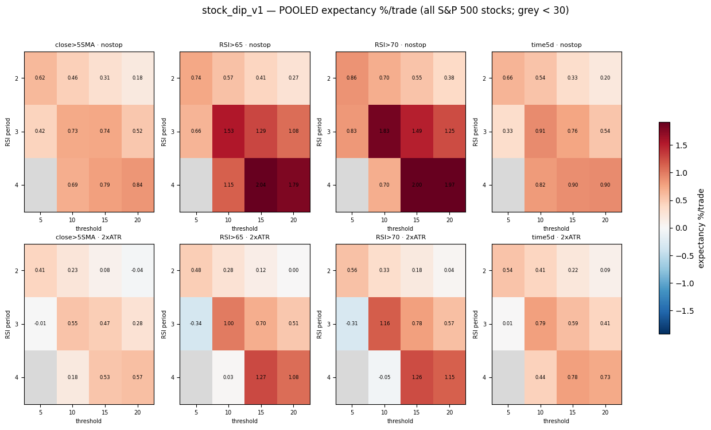
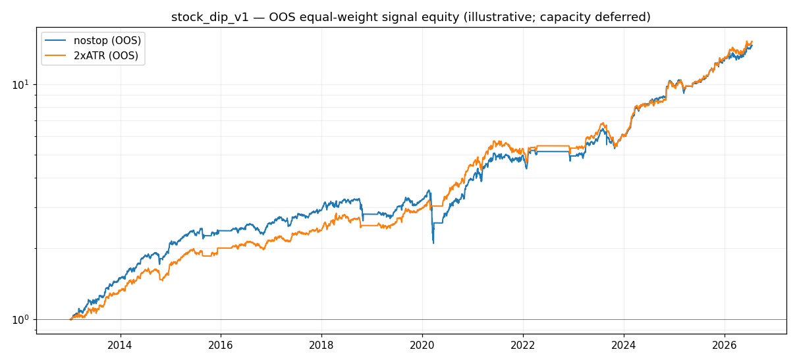

# Does Buying the Dip Work on Quality Stocks?

**Testing short-term mean reversion on individual S&P 500 stocks — and measuring how much of the "edge" is an illusion**

*Trading Rules Research · Experiment 02 · July 2026*

---

## How this was built

*Pulled from the running system this session, not written from memory.*

| | |
|---|---|
| **Hardware** | MacBook Pro, Apple M3 Pro (11 cores: 5P+6E), 36GB RAM — `system_profiler SPHardwareDataType` |
| **OS** | macOS 26.5.2, build 25F84 — `sw_vers` |
| **Python** | 3.9.6, project venv |

**Libraries actually imported** by this experiment's own scripts (`grep`, then `pip freeze` for versions):

| Library | Ver. | Role |
|---|---|---|
| pandas | 2.3.3 | stock series, pooled trade tables, PIT comparison |
| numpy | 2.0.2 | eligibility masks, metric arrays |
| matplotlib | 3.9.4 | pooled heatmaps + equity-curve figures |
| PyYAML | 6.0.3 | `config.yaml` + experiment spec |
| yfinance | 1.2.0 | daily OHLCV for ~750 ever-members |
| requests | 2.32.5 | HTTP layer under the fetch helpers |
| pyarrow | 21.0.0 | parquet read/write, local price cache |
| lxml (via `pd.read_html`) | 6.1.1 | scrapes today's S&P 500 list |

**Real data, simulated trading**: prices are real historical data, not simulated. What's
simulated is the trading — what these rules would have done. Synthetic price series appear
only in unit tests, never in a published result.

---

## What this paper tests — and what it doesn't

This paper tests **individual stocks**: buying short-term dips in high-quality S&P 500
companies that are already in strong uptrends. It asks whether that makes money after costs.

Experiment 01 asked almost the same question about whole **indices** (the S&P 500, DAX,
Nikkei and so on) and found the effect too rare to use. This paper moves down a level, from
the index to the individual companies inside it — where there are hundreds of instruments
instead of ten, and therefore thousands of trades instead of dozens. That change fixes the
problem that killed Experiment 01, and lets us reach a genuinely firm conclusion.

But it introduces a new problem — one that turns out to matter more than anything else in
this project. Testing a strategy on individual stocks quietly invites a bias so strong it can
manufacture profit out of nothing. Most of this paper is about finding it, measuring it, and
subtracting it.

**Short version of the result:** the strategy passed a strict, well-powered out-of-sample
test — genuinely, on nearly 9,000 trades it had never seen. Then a second test showed that
**about a third of that profit was an accounting illusion**, and once you also subtract the
cost of holding the positions, what's left is roughly zero. The behaviour is real. The
tradeable edge is not.

---

## 1. The idea being tested

The core idea is the same as Experiment 01 — short-term mean reversion, the tendency of sharp
drops to partly bounce back within a few days — but applied to individual companies and
combined with a quality filter.

The logic runs in two parts:

**First, only consider good stocks.** Not every company that dips is worth buying. So the
strategy only looks at stocks that are already in a genuine, established uptrend: trading
above their long-term averages, with those averages stacked in the right order, near their
52-week highs, and among the strongest performers in the index. This is a well-known filter
popularised by Mark Minervini (a US Investing Champion) and built on Stan Weinstein's earlier
"stage analysis." In plain terms: *only shop among the market's leaders.*

**Second, wait for one of those leaders to have a bad few days, then buy the dip** — and,
importantly, hold until it recovers its footing rather than selling at the first sign of a
bounce. (That "hold until strength returns" detail is not incidental — it's the one piece
that survived Experiment 01, and it earns its place again here.)

There's a nice symmetry to why this combination *should* work. Two well-documented market
behaviours operate on different clocks. Over months, trends persist — winners keep winning
(this is "momentum," one of the most robust patterns in all of finance). Over days, prices
overreact and snap back (this is mean reversion). So the strategy uses momentum to decide
*which* stocks are worth owning, and mean reversion to decide *which day* to buy them. Right
stock, right moment, two different tools for two different jobs.

---

## 2. Why challenge it? Three reasons to expect it might work

Unlike Experiment 01, where we were mostly skeptical, this idea had three separate things
going for it before we started — which is exactly why it was worth a serious test.

**First, the published research points here.** Short-term mean reversion is documented most
strongly in *individual stocks* rather than indices, and most strongly using very short-term
"oversold" measures. The economic reason is the same as before: a lot of short-term selling
is panic and forced liquidation rather than considered judgement, so prices overshoot and
recover. That effect is diluted in an index (which averages hundreds of stocks together) but
sharper in the individual names.

**Second, our own earlier work pointed here.** A full rules-based system we'd tested
separately showed that *breakout* entries — buying strength — lost money, while *pullback*
entries — buying weakness — made a little. Buying dips beat chasing rallies.

**Third, Experiment 01 pointed here.** At the index level, the one pattern that survived was
"buy a moderate dip and hold until strength returns." It worked — it was just too infrequent
to use, firing about once per market per year. Individual stocks solve that directly: hundreds
of companies means the same signal fires constantly.

So this wasn't a hunch. Three independent lines of evidence converged on the same hypothesis,
which is the ideal setup for a test that can actually settle something.

---

## 3. The bias that haunts this kind of test

Before any results, one concept needs explaining, because it's the hinge of the whole paper:
**survivorship bias.**

Here's the problem. To test a strategy on "S&P 500 stocks," you need a list of S&P 500 stocks.
The easy, free way is to grab today's list. But the S&P 500 of today is not the S&P 500 of
2005 — companies get added when they succeed and removed when they fail, go bankrupt, or get
acquired in distress. **Roughly 760 companies have passed through the index and left it** over
the period we study.

If you test "buy the dip on today's 500 companies" using history, you are only ever testing
companies that *survived* — the ones healthy enough to still be in the index now. Every
company that dipped and then went to zero has been quietly deleted from your experiment. And
those are precisely the cases where dip-buying would have hurt you most.

In other words: testing dip-buying on today's survivors is close to asking *"did buying dips
work, on the companies we already know recovered?"* The answer is almost guaranteed to look
good, and the goodness is partly fake.

To do this honestly you need a **point-in-time** record — who was *actually* in the index on
each historical day, delisted failures included. We used a public dataset that provides
exactly that. The gap between the naive answer and the honest one is the most important number
in this paper.

---

## 4. How the test was built

### The data

- **Prices:** daily history for S&P 500 stocks, from Yahoo Finance (free).
- **"Today's list":** the current S&P 500 membership, scraped from Wikipedia — used for the
  first, naive version of the test.
- **The honest list:** a public point-in-time membership dataset (`fja05680/sp500`) recording
  who was in the index on every day from 1996 to 2026 — including the ~760 companies that have
  since left. Used for the survivorship correction.

### The rules that varied, and the ones that didn't

As in Experiment 01, we tested many versions at once — 96 combinations of how "oversold" is
measured, how deep it must go, when to sell, and whether to use a stop-loss. Held constant:
a stock must pass the quality filter *and* the overall market must be healthy (the S&P 500
itself above its 200-day average) before any purchase.

**Costs were charged on every trade** (slippage plus commission), and every figure below is
after costs.

### The honesty rules

Same discipline as Experiment 01, plus one addition it forced on us:

- **Split the data.** Explore only on pre-2013 history; seal everything from 2013 onward.
- **Pre-register.** Write down the exact rule and the exact pass/fail bar *before* touching the
  sealed data, and never edit it after.
- **Binding criteria.** A miss is a death — no renegotiating once the numbers are in.
- **The new rule (a lesson from Experiment 01):** before running the sealed test, check that
  it will produce *enough trades to be meaningful.* Experiment 01 failed this — 81 trades
  can't confirm anything. This one projected around 2,000, so it could genuinely confirm or
  refute.

A note on three recurring terms: **expectancy** is average profit per trade (the key number);
**profit factor** is total gains ÷ total losses (above 1.0 is profitable); **drawdown** is the
worst fall from a peak along the way.

---

## 5. Result, part one: exploration looks excellent

On the pre-2013 exploration data, the result was strikingly better than the index version.
**Almost the entire grid was profitable** — every combination of settings we tried made money,
from about +0.3% to +2.0% per trade. Two sensible patterns appeared:



*Every strategy variant tested on pre-2013 data. Each of the eight panels is one combination of exit rule and stop-loss; within a panel, rows are the RSI lookback (2–4 days) and columns are how deep the oversold reading has to go (RSI below 5 through 20). Each cell's colour is its average profit or loss per trade after costs — red is a loss, pale yellow is roughly break-even, and nearly all visible cells are green or near-white, meaning almost every variant was profitable in exploration. The handful of mildly negative cells (the two −0.3-ish entries in the RSI>65/RSI>70, 2×ATR panels) sit in pale salmon. Grey marks cells with too few trades to interpret.*

- **Deeper dips paid more** — the more oversold the entry, the bigger the bounce.
- **Holding until strength returns beat selling the first bounce** — the same detail that
  survived Experiment 01, strongest again here.

Two encouraging signs beyond the raw profit:

- **It wasn't a fluke of a few settings.** A broad, smooth region of the grid worked, not one
  isolated lucky cell. When neighbouring settings all work and the good ones shade gradually
  into the less-good ones, you're probably looking at a real effect rather than a coincidence.
- **It had enough trades to test properly** — the projected sealed-data sample was in the
  thousands, clearing the bar Experiment 01 had failed.

The effect had weakened since the late 1990s but was still clearly positive in the years just
before the sealed cutoff. Not a dead relic — but decaying, which made the sealed test a
genuine question rather than a formality.

---

## 6. Result, part two: it passes the sealed test — for real this time

Before touching post-2013 data, this was written down and locked:

> **The rule:** among quality S&P 500 stocks, when a 2-day oversold measure drops below 10 and
> the broad market is healthy, buy at the close and hold until short-term strength returns.
> Two versions: without a stop-loss, and with one.
>
> **It fails unless:** average expectancy is positive after costs; profit factor is at least
> 1.10; and it's profitable in **both** halves of the 2013–2026 period (so it can't just be
> riding one lucky stretch).

**It passed all three, on 8,877 trades:**

| Test | Result | |
|---|---|---|
| Positive expectancy | **+0.276% per trade** | Pass |
| Profit factor ≥ 1.10 | **1.26** | Pass |
| Positive in both halves | +0.263% and +0.290% | Pass |

This is a real pass, and a meaningful one. Nearly 9,000 trades is enough to trust — the
opposite of Experiment 01's 81. The strategy was profitable in 11 of 14 individual years, and
the three losing years were all market-stress periods. Notice something important: 2022 (a
bad bear market) barely registered, because the "is the overall market healthy?" filter had
kept the strategy sitting in cash for most of it. That filter — the one component this whole
research project keeps confirming — did its job again.



*The pre-registered variant running on the sealed 2013-onwards data it had never seen — growth of one unit on a log scale, shown for both the no-stop version (blue) and the version with a 2×ATR stop (orange). The strategy completed approximately 9,000 trades across ~14 years of sealed data. Each step is a completed trade; the stair-step pattern reflects the discrete, trade-by-trade nature of the signal. Both versions trend upward overall, though with notable drawdowns around market-stress periods, particularly visible in 2020.*

The edge had roughly halved from its exploration-era level, but then **stopped decaying** —
the two halves of the sealed period are nearly identical, and recent years are among the
stronger ones. An effect that shrinks and then stabilises is the signature of something real
that competition has partly, but not fully, arbitraged away.

At this point, on the strength of a properly-run, well-powered, out-of-sample test, this looks
like a validated strategy. If the paper stopped here, it would be a success story.

It shouldn't stop here.

---

## 7. Result, part three: how much of that was an illusion?

Everything above used **today's** S&P 500 — the survivors. Time to do it honestly.

### First: how much of the real index can free data even see?

Using the point-in-time membership list, we checked, for each era, how many of the companies
*actually* in the index back then still have usable price data today.

| Era | Real members | Still visible in the data | Coverage |
|---|---|---|---|
| 1996–2000 | 666 | 270 | **41%** |
| 2001–2005 | 587 | 307 | 52% |
| 2006–2010 | 644 | 392 | 61% |
| 2013–2016 | 593 | 437 | 74% |
| 2017–2020 | 604 | 494 | 82% |
| 2021–2026 | 621 | 565 | **91%** |

Read that column from top to bottom. **That fading coverage *is* survivorship bias, made
visible.** The further back you look, the more of the real index has vanished from the free
data — and what vanishes is overwhelmingly the failures: the bankruptcies, the distressed
buyouts, the companies dropped for poor performance. Exactly the stocks a dip-buyer would have
been hurt on.

It also tells us which numbers to trust. The sealed period (2013 onward) is ~81% covered — good
enough to correct meaningfully. The old exploration period is only ~52% covered — too holed to
fix, because you can't add back losers you can't see.

### Then: re-run the exact same strategy on the honest list

Nothing about the strategy changed — only the universe. On each historical day, it now trades
the companies *actually in the index that day*, failures included.

| | Today's survivors | Honest (point-in-time) | Difference |
|---|---|---|---|
| Expectancy per trade | +0.276% | **+0.185%** | **−0.091%** |
| Profit factor | 1.26 | 1.18 | −0.08 |

**About a third of the apparent edge was survivorship bias** — profit that existed only
because the losing companies had been deleted from the test. The direction and persistence of
the effect survived (still positive across the era, still positive in both halves), but the
*size* dropped by a third from just this partial correction.

And "partial" matters: even the honest list is still missing ~19% of the real members — and
those missing names skew toward the worst outcomes. So +0.185% is still an **overstatement**.

---

## 8. The final subtraction: financing

One cost hasn't entered yet. This strategy holds positions for about six days each. If you
trade it with borrowed money (as leveraged products require), you pay overnight financing —
roughly 0.09% per trade at typical rates.

Now stack everything up honestly:

```
+0.276%   what it looked like on today's survivors (the flattering version)
  ↓ −0.091   remove the survivorship bias we can measure
+0.185%   honest — but still an overstatement (19% of losers still missing)
  ↓          the missing names would push this lower still
  ↓ −0.09    subtract the cost of financing the positions
≈ 0% to +0.10%   what's plausibly actually left  (best guess: ~+0.05%)
```

And the version with a stop-loss — the one any sane person would actually trade — comes out at
+0.045% before financing, which is break-even to negative after it.

For comparison: a trading cost of around 0.10% per trade is the hurdle this has to clear. It
doesn't clear it with any room to spare. The edge and the costs are the same size.

---

## 9. The verdict

**The phenomenon is real. The tradeable edge is not.**

Those two sentences aren't a contradiction, and the gap between them is the whole point of the
paper. It is genuinely true that quality stocks, when they dip, tend to bounce — that survived
a strict test, held up out-of-sample, and persisted even after correcting for survivorship.
It is also true that once you honestly account for the companies that failed and the cost of
holding the trades, the profit left over is about the same size as the costs of capturing it.

A documented market behaviour and a profitable strategy are different things, separated by
three unglamorous realities: the trades cost money, the losers get hidden from your data, and
a headline backtest number is not a net one.

This was **not turned into a trading strategy**, because there's nothing solid enough left to
build one on. That is the correct outcome — and it was reached in an afternoon of computation
rather than through two years of losing money finding out the hard way.

---

## 10. What this experiment is actually worth

No strategy came out of it. But three things did:

1. **A measured price tag for survivorship bias.** In this case, about a third of the apparent
   profit — before costs even entered the conversation. That number is the most transferable
   result here: anyone reading a glowing stock backtest should now ask "and how much of that is
   survivorship?" This paper shows how to find out.
2. **Confirmation of the market-health filter, again.** For the third time in this project, the
   "only trade when the broad market is healthy" rule proved its worth — here by keeping the
   strategy out of the 2022 bear market almost entirely.
3. **A validated behaviour to reuse.** "Buy quality stocks on short-term weakness, hold until
   strength returns" is real, even if it's not a standalone money-maker. It could still improve
   the *timing* of positions you were going to take anyway — where the financing is already
   being paid and the survivorship question doesn't apply.

---

## 11. Honest limitations

- **Even the corrected number is an overstatement**, in a known direction: ~19% of real index
  members are still missing from free data, skewed toward failures. Fully settling the
  magnitude would need a paid database that includes delisted companies.
- **The honest membership list only reaches back to 1996**, so the corrected exploration
  window is both shorter and only half-covered.
- **This measured individual trades, not a portfolio.** Position limits, how many trades run at
  once, and correlation between them were deliberately left for later — and never needed, since
  the edge didn't justify building a portfolio around it.
- **Financing costs are estimated** from typical rates, not a specific broker's schedule.
- **US large-caps only.** Nothing here automatically extends to other markets or company sizes.

---

## 12. Reproducing this

```bash
# exploration phase — the full grid, pre-2013 data only
python research.py --experiment stock_dip_v1 --phase insample

# sealed test — refuses a grid; accepts only the pre-registered version
python research.py --experiment stock_dip_v1 --phase oos \
    --variant 'rsi_period=2;threshold=10;exit=RSI>65;stop=nostop'

# the survivorship correction: measure data coverage, then re-run honestly
python research/pit_coverage.py
python research/pit_rerun.py
```

Everything runs on a laptop using free data.

---

## 13. Sources

- Connors, L. & Alvarez, C. (2008). *Short Term Trading Strategies That Work* (the short-term
  mean-reversion research).
- Minervini, M. (2013). *Trade Like a Stock Market Wizard* (the quality / trend filter).
- Weinstein, S. (1988). *Secrets for Profiting in Bull and Bear Markets* (stage analysis).
- O'Neil, W. (1988). *How to Make Money in Stocks* (the market-health filter).
- `fja05680/sp500` — public point-in-time S&P 500 membership dataset (the honest list).
- Price data: Yahoo Finance, via the `yfinance` Python library.

---

## Where this sits in the series

| # | Question | Instrument | Verdict |
|---|---|---|---|
| 01 | Does dip-buying work on indices? | Indices | Survives, but too rare to use |
| **02** | **Does dip-buying work on quality stocks?** | **Individual stocks** | **Real behaviour, but the edge ≈ its costs once survivorship is removed** |

---

*This is a research project, not investment advice. All results are simulations using free
public data, net of modelled costs. No strategy described here is recommended for use with
real money, and the author holds no position based on any of it.*
