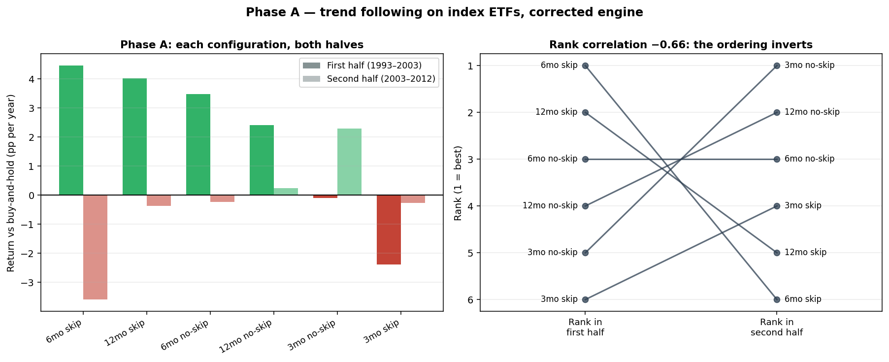
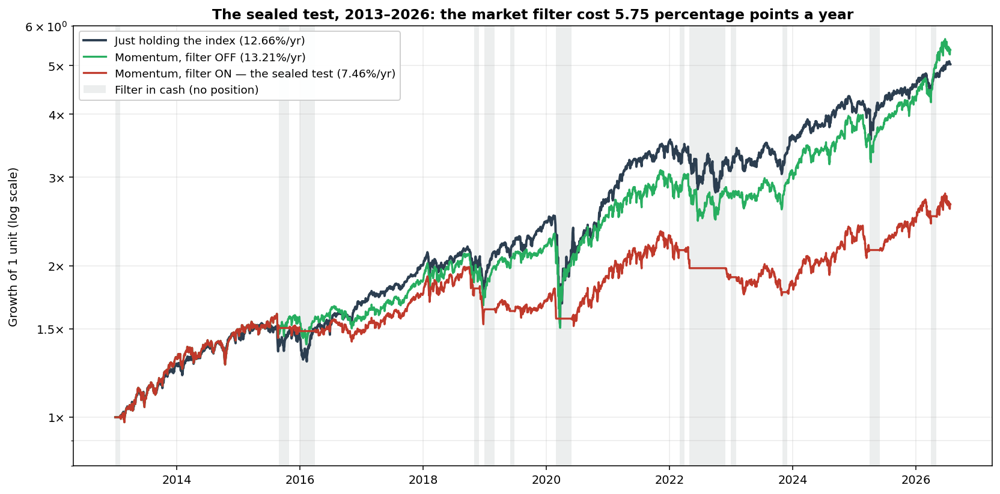
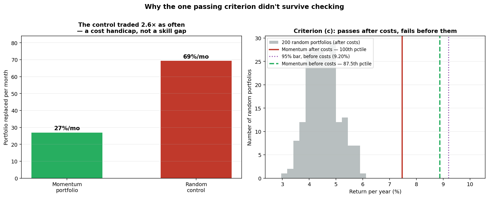

# Does Momentum Work? Testing "Winners Keep Winning" on Indices and Stocks

**Two phases, one sealed test, and a control that didn't survive checking**

*Trading Rules Research · Experiment 03 · July 2026*

---

## How this was built

*Pulled from the running system this session, not written from memory.*

| | |
|---|---|
| **Hardware** | MacBook Pro, Apple M3 Pro (11 cores: 5P+6E), 36GB RAM — `system_profiler SPHardwareDataType` |
| **OS** | macOS 26.5.2, build 25F84 — `sw_vers` |
| **Python** | 3.9.6, project venv |

**Libraries actually imported** by this experiment's own scripts (`grep`, then `pip freeze` for versions):

| Library | Ver. | Role |
|---|---|---|
| pandas | 2.3.3 | portfolio state, monthly returns, all result tables |
| numpy | 2.0.2 | vectorised P&L, `corrcoef`, `percentile`, `rng.permutation` |
| matplotlib | 3.9.4 | the three figures in this paper |
| PyYAML | 6.0.3 | `config.yaml` (costs, wall) |
| yfinance | 1.2.0 | daily OHLCV, index ETFs + ~750 stock tickers |
| requests | 2.32.5 | HTTP layer under the fetch helpers |
| pyarrow | 21.0.0 | parquet read/write, local price cache |

**Real data, simulated trading**: prices are real historical data, not simulated. What's
simulated is the trading — what these rules would have done. Synthetic price series appear
only in unit tests, never in a published result.

---

## What this paper tests — and what it doesn't

The first two papers in this series tested **mean reversion**: buying things that had just
fallen. This one tests the opposite idea — **momentum**, the tendency of things that have been
rising to keep rising.

It comes in two phases, because momentum has two quite different forms:

- **Phase A — trend following on indices.** Hold an index if it's been going up; sit in cash if
  it hasn't. Each market judged against its own past.
- **Phase B — ranking stocks against each other.** Each month, buy the strongest performers in
  the S&P 500 and sell the rest.

Bonds, commodities and currencies are deliberately excluded; they'd be a separate experiment.

**Short version of the result: everything failed.** Phase A wasn't robust enough to justify
spending a test on. Phase B was pre-registered, sealed and tested — and lost decisively to
simply owning an index fund. One secondary result initially appeared to survive; a follow-up
check showed roughly three quarters of it was an artifact of how the comparison was built.

That last part is the most useful thing in this paper, and it's a lesson about controls rather
than about markets.

---

## 1. The idea being tested

Momentum is the observation that assets which outperformed over the past three to twelve months
tend to keep outperforming over the next few. It was documented by Jegadeesh and Titman in 1993
— roughly 1% a month of abnormal return in US stocks — and has since been confirmed across
dozens of countries and across stocks, bonds, currencies and commodities. It is, by a wide
margin, the most robust anomaly in finance.

The usual explanation is behavioural: information spreads slowly, investors under-react at
first and then pile in, so a genuine improvement in a company's prospects gets priced in over
months rather than minutes.

There's also a structural reason we wanted to test it. The first two experiments in this series
both died to **costs** — strategies that trade often pay a toll bigger than their edge.
Momentum holds positions for weeks or months rather than days, so the toll should be far
smaller. If any strategy family was going to survive realistic cost accounting, this was the
candidate.

---

## 2. Why test something this well established?

Not because the research is doubtful. It isn't. Three specific gaps sit between "momentum
exists" and "momentum makes retail money":

**It has weakened.** US large-cap momentum returns fell from roughly 1% a month historically to
around 0.3% after 2000. An effect can be real, published, and mostly arbitraged away.

**It crashes.** Momentum has a well-documented failure mode: at the bottom of a bear market, the
most beaten-down junk rockets hardest, and a portfolio of recent winners badly lags for months.
Daniel and Moskowitz named this "momentum crashes." It's rare, violent, and precisely the sort
of thing an ordinary backtest average hides.

**Expressing it costs money.** Owning the top slice of an index means holding a concentrated
portfolio and rebalancing it regularly. That's a structurally more expensive thing to own than
an index fund, regardless of whether the signal works.

So the question isn't "is momentum real" — it's **"after the costs of actually running it, does
it beat just buying the index?"**

---

## 3. How the tests were built

### Data

All prices came from Yahoo Finance via the `yfinance` Python library, daily bars only.

**Phase A** used eight index ETFs — SPY, QQQ, EFA and EEM, plus regional funds covering Germany,
Japan, the UK and China. Available history begins in 1993 (SPY's inception) and the funds launch
at different dates through 2004.

**Phase B** used S&P 500 constituents, with membership taken from a **point-in-time** dataset
(`fja05680/sp500`) recording who was actually in the index on each historical day, rather than
today's survivors. This matters enormously and is explained in Paper 02.

### The rules

**Phase A:** each month, hold the index if its return over the lookback window was positive,
else hold cash. Twelve variations — three lookback lengths (3, 6, 12 months) × two signal types
(total return, or return excluding the most recent month) × market filter on or off.

**Phase B:** each month, rank all eligible stocks by lookback return and hold the top slice,
equally weighted. Thirty-six variations — three lookbacks × three hold sizes (top 10%, top 20%,
top 10 names) × filter on/off × quality-screen on/off.

Costs were charged on every trade throughout: 0.1% slippage per side plus 0.2% round-trip
commission.

### The honesty rules

The same protocol as the earlier papers: explore only on data up to 2012, seal everything after,
pre-register the exact rule and pass/fail criteria before touching sealed data, and treat the
criteria as binding. Two additional standards applied here, each earned by an earlier mistake:

- **A power check** — project how many trades the sealed test will produce; under about a
  hundred, only failure can be concluded (the lesson from Paper 01).
- **A window-split robustness test** — before spending the sealed shot, check whether the edge
  holds in *both halves* of the exploration data. This one was adopted mid-experiment, and it
  immediately killed Phase A.

---

## 4. Phase A — trend following on indices

On the full exploration window, the best configuration beat buy-and-hold by about **2.2
percentage points** a year. Promising, until you split the window in half.

First, a correction to the design. The twelve variations described above were really **six**: the
market-filter arm had never been wired into the code, so each pair of configurations was
identical. That was one of several problems an audit turned up, described in the next section.
All figures here come from the corrected engine.

**In the first half, four of the six configurations beat buy-and-hold. In the second half, only
two did.** That's a warning sign rather than proof of anything, so we ran the proper test: rank
every configuration by how well it did in the first half, rank them again by the second half, and
see whether first-half success predicts second-half success.

**It doesn't.** The rank correlation was **−0.66** — if anything the ordering inverts, though at
six configurations that isn't statistically significant in either direction. What *is* clear is
the absence of any positive relationship: the configurations that worked early were not the ones
that worked later. Only one configuration beat buy-and-hold in both halves, against a chance
expectation of 1.3.

There's a second problem, independent of all this. The two halves aren't testing the same thing.
The ETF universe grows from one fund to eight over the period — **31.5% of first-half days held
only SPY.** The first half is a one-to-six-instrument strategy; the second is a
six-to-eight-instrument one. Any comparison between them is confounded by diversification.



*Left: the six genuinely distinct configurations, ordered by how well they did in the first
half of the exploration window. The dark bar is the first half (1993–2003), the pale bar the
second (2003–2012), measured as annual return above or below buy-and-hold — green above the
line, red below. Every configuration that cleared buy-and-hold in the first half falls back
below it in the second, except one. Right: the same six ranked in each half and joined by a
line. If early success predicted later success the lines would run roughly flat; instead they
criss-cross, with the first half's best configuration (6-month, skip) finishing last and the
second half's best (3-month, no-skip) having been fifth of six. That crossing pattern is the
−0.66 rank correlation made visible.*

**Verdict: not robust. Closed as a documented negative, with no sealed test spent on it.**

That decision — declining to spend the one-shot test on something the exploration data had
already flagged as fragile — was the direct lesson of Paper 01, where exactly that mistake was
made.

---

## 5. An interruption: what went wrong, and how it was caught

This experiment produced more errors than the previous two combined, and the reason is worth
stating plainly: **part of it was run using a less capable AI model.** The failures weren't
typos — they were reasoning errors:

- Phase B was initially run over a window that **predated the membership data entirely**, so for
  thirty years the strategy held nothing. All 36 configurations returned identical results, and
  a later segment produced a CAGR in the hundreds of thousands of percent.
- The calculation engine had **four separate defects**: trading costs charged on the entire
  portfolio every month regardless of how much actually changed hands; a slippage parameter
  computed and then never used; a metric measuring the wrong quantity; and an implicit
  assumption of free *daily* rebalancing that silently changed the strategy being tested.
- A figure reported as a measurement — "the market was favourable 100% of the time in-sample" —
  turned out to be **a hardcoded line of text that had never been computed.** Measured properly,
  the market was *unfavourable* 28% of the time, so the true favourable figure was roughly 72%,
  not 100%. The claim mattered because it had been used to argue that one arm of the test was
  inert for benign reasons; the real reason was that the arm had never been wired in at all.
- A causal explanation was written up as an established finding when the test supporting it had
  never been run.

Every one was caught before publication, by two mechanisms: a **separate reviewer with no stake
in the results**, and a habit of **re-verifying headline numbers against source data** rather
than trusting a previous write-up. The engine was rebuilt with tests that pin the arithmetic to
twelve decimal places, and a plausibility guard was added that aborts a run rather than
reporting an implausible number — which then immediately caught a genuine data-corruption
problem (a former S&P industrial's ticker now resolving to a penny instrument with fake
$11,000 placeholder bars; 37 symbols were screened out in total).

The errors themselves are unremarkable. That they were caught is the point, and it's why the
numbers below can be read with some confidence.

---

## 6. Phase B — ranking stocks, exploration phase

On the exploration data the picture was much better than Phase A. Two configurations for
reference, against an equal-weight benchmark of all index members:

| | Return/yr | Sharpe | Worst drawdown |
|---|---|---|---|
| Benchmark (all members) | 10.00% | 0.48 | −58.5% |
| Best configuration | 19.84% | 0.82 | −28.8% |
| Middle-of-the-road configuration | 12.33% | 0.75 | −22.5% |

Higher returns *and* roughly half the drawdown. Against randomly-chosen portfolios of the same
size, the momentum portfolios finished at the very top.

But the same robustness test that killed Phase A gave a warning here too: **which configuration
performs best does not persist between the two halves** of the exploration window. Rank
correlation +0.39 with a p-value of 0.11 — statistically indistinguishable from chance.

That mattered for how the sealed test was designed. If you can't tell in advance which settings
will work, you can't defensibly pick the in-sample winner. So the configuration sent to the
sealed test was chosen **on theory, not on performance**: a 12-month lookback (the standard
horizon in the academic literature), the top 20% of the index (a conventional quintile), market
filter on. That's the middle configuration in the table above, not the best one.

Choosing on theory rather than on backtest ranking is the more defensible move, and it
sidesteps the selection problem entirely.

---

## 7. The sealed test

Pre-registered before any post-2013 data was touched, and never edited afterwards. Two versions
were declared: the primary (with the market filter) and a secondary (identical but unfiltered),
so the filter's contribution could be measured directly. Four binding criteria on the primary.

**Result, over 163 monthly rebalances from 2013 to 2026:**

| | Return/yr | Sharpe | Worst drawdown | Turnover/mo |
|---|---|---|---|---|
| Just holding the index | **12.66%** | **0.73** | −39.6% | 3.5% |
| Strategy, filter on *(the test)* | **7.46%** | **0.50** | −25.5% | 27.0% |
| Strategy, filter off | 13.21% | 0.72 | −35.1% | 25.2% |

| Criterion | Result | |
|---|---|---|
| (a) Beat the index on return | 7.46% vs 12.66% | **FAIL** |
| (b) Beat the index risk-adjusted | 0.50 vs 0.73 | **FAIL** |
| (c) Beat 95% of random portfolios of the same size | 100th percentile | PASS |
| (d) Profitable in both halves of the period | yes | PASS |

**The strategy dies.** It earned five percentage points a year less than an index fund, with
worse risk-adjusted returns, while trading eight times as often.



*The sealed test on data the strategy had never seen. Growth of one unit on a log scale: dark
blue is simply holding the index, green is the strategy with the market filter off, red is the
pre-registered strategy with the filter on. Grey bands mark the months the filter held cash.
All three track each other closely until 2018; from there the red line falls progressively
behind and never recovers, ending near 2.7× against the index's 5.1×. The flat red stretches
inside the grey bands are the filter sitting out — and the damage is visible in what happens
around them. Its long exit through 2022 spans the market's decline but also most of the
recovery, so it locks in the fall and misses the rebound. The green line shows the ranking
alone: essentially level with the index across the whole window.*

### The market filter didn't just fail — its rationale was falsified

The filter destroyed value in every window, costing **5.75 percentage points a year**. But the
interesting part is *how* it failed.

In the exploration data, the filter's single best environment had been the slow grinding decline
of 2000–2002, where it added nearly 23 percentage points by sitting in cash. That was its whole
justification: it protects you through long declines.

| Episode | Filter's contribution | Predicted |
|---|---|---|
| The sharp V-shaped crash of 2020 | −3.20pp | hurt ✓ |
| The grinding bear market of 2022 | **−8.95pp** | help ✗ |

The 2022 grind — the exact environment the filter was supposed to own — was its **worst episode
of the entire sealed window**, and it lost even to simply holding the index.

A diagnostic run beforehand had predicted this, though we didn't fully believe it at the time.
It found that the filter is inactive in 145 of 203 historical months, and that among the 58
months it *is* active, its entire value comes from about **ten specific episodes** — the other
48 months are a net drag. When your whole effect is ten events, the next ten events are a fresh
draw. They came up empty.

---

## 8. The result that didn't survive checking

Criterion (c) passed, and it initially looked like the one real finding: against 200 randomly
selected portfolios of the same size, the momentum portfolio finished at the 100th percentile.
No random draw ever reached it. That control exists to test the *hypothesis* — does ranking by
momentum carry information? — separately from whether the strategy makes money.

Then a follow-up question: **was the control matched on how often it traded?**

It wasn't. Picking fresh names from roughly 427 eligible each month means replacing most of the
portfolio monthly — about 69% on the pre-registered version, and 80% on the unfiltered one, where
no month is ever spent in cash. Momentum, whose winners tend to remain winners, replaced about
25–27%. So on the version being tested the random portfolios paid roughly **two and a half times
the trading costs** — a handicap with nothing to do with skill.

Comparing the two *before* costs, which is what the control was actually for:

| | With costs | Before costs |
|---|---|---|
| Percentile vs random (the pre-registered version) | 100th | **87.5th** |

**Below its own 95th-percentile bar.** About 73% of the apparent edge was the cost mismatch.



*Left: how much of the portfolio each approach replaced per month, for the version actually
pre-registered. The random control turned over 69% a month against momentum's 27% — about 2.6
times as much trading, purely because a fresh random draw keeps almost nothing while momentum's
winners tend to stay winners. Right: the 200 random portfolios' annual returns after costs
(grey), with the momentum result marked twice. After costs (solid red) it sits to the right of
every single random portfolio — the 100th percentile that the criterion recorded as a pass.
Before costs (dashed green), with the trading handicap removed from both sides, it falls back
to the left of the 95% bar (dotted purple) at the 87.5th percentile — a fail. The gap between
those two lines is the entire finding: it is the cost mismatch, not predictive skill.*

Splitting by period makes it worse. Cost-matched, the signal is **absent in the first half** of
the sealed window — the momentum portfolio actually finished *below* the random average, at the
26th percentile — and appears only in the second. By this project's own persistence standard,
the one adopted after Phase A, that fails.

One further check confirmed the mechanism: before costs, a random 85-stock portfolio returned
12.75% against the 427-stock benchmark's 12.66% — essentially identical. The 4.2-point gap
between them, which had looked like a penalty for concentration, was **entirely trading costs.**

**The general lesson, and the most transferable thing in this paper:** a random-portfolio
control matched on *size* but not on *turnover* doesn't measure predictive skill. It measures
**persistence** — and it systematically flatters any strategy that holds its positions, which
is exactly what momentum does. The standing rule adopted afterwards: random controls must be
matched on turnover, not just on how many things they hold.

---

## 9. Verdict

**Experiment 3 is a complete negative.**

- Phase A: trend following on indices — not robust across periods, closed without a sealed test.
- Phase B: the pre-registered strategy lost to an index fund on both return and risk-adjusted
  return.
- The market filter destroyed value in every window, and the specific rationale for it was
  falsified in the exact environment it was designed for.
- The one criterion that passed did not survive a cost-matched re-examination, and fails the
  project's own persistence standard.

Momentum as a phenomenon is not refuted by any of this — the academic literature stands, and
nothing here contradicts it. What this experiment shows is narrower and more practical: **at
retail scale, with realistic costs, the tested implementations don't beat owning an index
fund.** That's now three experiments out of three where the signal was real enough and the
costs were the same size as the edge.

---

## 10. Honest limitations

- **Absolute returns are survivorship-inflated.** Free data can only see about half of the
  index's true historical membership, and the missing names skew toward failures. The verdict
  rests on *relative* comparisons against a benchmark built from the identical universe, which
  is why it holds regardless — but the absolute figures are upper bounds.
- **The market filter tested was a simple 200-day-average proxy**, not a more sophisticated
  multi-factor version. This is evidence about that proxy, not a refutation of every possible
  market filter.
- **Costs are modelled**, not measured against a real broker's fills.
- **Phase A is confounded** by a growing ETF universe, as described above, independent of its
  other problems.
- **The sealed test is one window.** Thirteen years containing one sharp crash and one grinding
  bear market is a fair test, but it is still a single sample.
- **Nobody independent has reproduced this.** Verification was internal — recomputation from
  source, plus review by a party with no stake in the outcome. The data is published so that
  someone else can check.

---

## 11. Reproducing this

```bash
# Phase A exploration (index trend following, pre-2013 only)
python research_momentum_phase_a3.py

# Phase B exploration (stock ranking, pre-2013 only)
python research_momentum_phase_b2.py

# The sealed test — runs only the pre-registered configuration
python research_momentum_oos.py
```

The pre-registered configuration is fixed inside the sealed runner rather than passed as an
argument, so it cannot be varied after the fact. Data files, the pre-registration and the
verdicts are in this folder; `DATA.md` documents every file and column. Everything runs on a
laptop using free public data.

---

## 12. Sources

- Jegadeesh, N. & Titman, S. (1993). *Returns to Buying Winners and Selling Losers.*
- Asness, C., Moskowitz, T. & Pedersen, L. (2013). *Value and Momentum Everywhere.*
- Daniel, K. & Moskowitz, T. (2016). *Momentum Crashes.*
- Moskowitz, T., Ooi, Y. & Pedersen, L. (2012). *Time Series Momentum.*
- Price data: Yahoo Finance, via the `yfinance` Python library.
- Historical index membership: the public `fja05680/sp500` dataset.

---

## Where this sits in the series

| # | Question | Instrument | Verdict |
|---|---|---|---|
| 01 | Does dip-buying work on indices? | Indices | Survives, but too rare to use |
| 02 | Does dip-buying work on quality stocks? | Individual stocks | Real behaviour, edge ≈ its costs once survivorship is removed |
| **03** | **Does momentum work?** | **Indices and stocks** | **Complete negative — and a control that flattered it** |

---

*This is a research project, not investment advice. All results are simulations using free
public data, net of modelled costs. No strategy described here is recommended for use with real
money, and the author holds no position based on any of it.*
